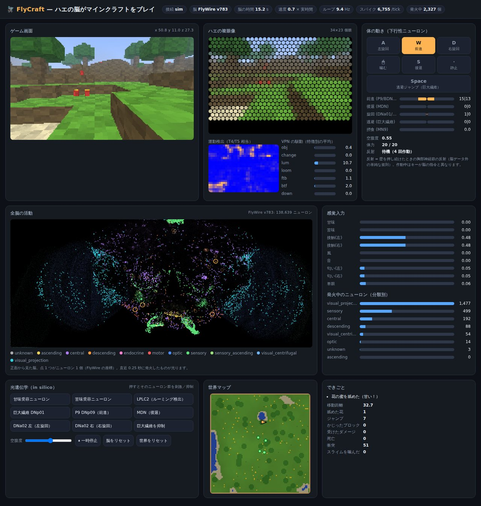
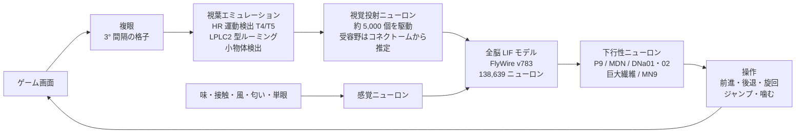

# FlyCraft 🪰⛏️ — ハエの脳にマインクラフト統合版をプレイさせる（Windows）

キイロショウジョウバエの**全脳コネクトーム**（FlyWire：138,639 ニューロン・1,509 万結合・5,449 万シナプス）を、
そのままスパイキングニューラルネットワークとして動かし、

- Minecraft 統合版の画面を**複眼**で見せ、
- 味・接触・風・匂いを**感覚ニューロン**に入れ、
- 脳の**下行性ニューロン**の発火でキャラクターを歩かせる・曲がらせる・跳ばせる・噛ませる

Windows 用のツールです。行動を決めるのはプログラムされたルールではなく、実際のハエの脳の配線を流れるスパイクです。



---

## できること

| モード | コマンド | 目・体 | 向いている環境 |
|---|---|---|---|
| **画面 + キー入力（メイン）** | `python -m flycraft screen` | 画面キャプチャ + 仮想キーボード・マウス | Windows 版の統合版を、人と同じように操作させる |
| **内蔵ワールド** | `python -m flycraft sim` | 付属のミニ・ボクセルワールド | まず試す。Minecraft 不要 |
| **統合版 WebSocket** | `python -m flycraft bedrock` | `/connect` で接続し、コマンドで移動 | スマホ・タブレットの統合版など（チートが必要） |

どのモードでも、ブラウザに**ライブダッシュボード**が開きます:

- ゲーム画面と、ハエの**複眼に写った像**（六角形の個眼）、運動検出の結果
- **全脳 138,639 ニューロンの発火**（FlyWire の座標で正面から見た脳が光る）
- 下行性ニューロンの発火率と、押されているキー（W/A/S/D・Space・クリック）
- **in silico 光遺伝学**：ボタン 1 つで「甘味受容ニューロン」「巨大繊維」「DNa02 左」などを刺激・抑制して、行動が変わる様子を見られる

---

## しくみ



### 脳（`flycraft/brain.py`）

- FlyWire v783 の全ニューロン・全結合をそのまま使う Leaky Integrate-and-Fire モデル。
  パラメータと結合の符号（神経伝達物質の予測）は Shiu et al. 2024 (*Nature*) の全脳モデルと同じ。
- 50 ms ごとに感覚入力を更新して脳を 0.5 ms 刻み（画面モードは 1 ms 刻み）で進める。numba で並列化した
  イベント駆動シミュレーションで、4 コアの CPU でほぼ実時間〜1.6 倍速。
- Minecraft と同じ PC で動かすと CPU の取り合いになり、並列処理のスピン待ちで **13 倍遅くなる**ことを実測したため、
  画面・WebSocket モードではスピンしない待ち方にし、実行中に最速のスレッド数を自動で選ぶ。
- `--engine numba-lazy`: 入力が届いたニューロンと閾値に届きうるニューロンだけを積分し、残りは線形 ODE の
  厳密解でまとめて進める実装（基準実装とスパイクが完全一致することをテスト済み）。
- 検証: 糖受容ニューロンの活性化で口吻伸展の運動ニューロン MN9 が発火する（Shiu et al. の主結果）、
  LPLC2 の活性化で巨大繊維が発火する、などをテストで確認している。

### 目（`flycraft/vision.py`, `flycraft/retinotopy.py`）

1. 画面を 3° 間隔の格子に平均化して「個眼」の輝度を得る（本物のハエは約 5°）。
2. **視葉をソフトウェアで模倣**:
   ハッセンシュタイン・ライヒャルト型の運動検出器（T4/T5 相当）で局所運動を計算し、
   - LPLC2 / LC4 など: 受容野の**上下左右 4 方向すべてで外向き**の運動（迫ってくる物体）にだけ応答（Klapoetke et al. 2017）。
     歩いたときの地面の流れや旋回では応答しない
   - LC10 / LC11 / LC17 など: 周囲と違う動きをする小さな物体
   - HS / LLPC: 前→後の運動、LPC / H2: 後→前、VS: 下向き、MeTu: 明るさ
3. 各視覚投射ニューロンが**視野のどこを見ているか**はコネクトームから推定する:
   視細胞の終末位置の主成分分析で視野の向きを決め（複眼背縁 DRA が上を向くことで検証）、
   シナプスをたどって下流へ伝播させる。

### 体（`flycraft/motor.py`, `flycraft/senses.py`）

| 行動 | 読み出すニューロン | 根拠 |
|---|---|---|
| 前進（W） | DNp09 (P9), DNg100 (BDN2) | Bidaye et al. 2020 |
| 後退（S） | MDN（ムーンウォーカー） | Bidaye et al. 2014 |
| 旋回（マウス左右） | DNa02, DNa01 の左右差（同側へ曲がる） | Rayshubskiy et al. 2020 (bioRxiv) |
| 逃避ジャンプ（Space） | DNp01（巨大繊維）, DNp02/04/11 | von Reyn et al. 2014, Ache et al. 2019 |
| 噛む（左クリック） | MN9（口吻伸展運動ニューロン） | Shiu et al. 2024 |

| 感覚 | 入力するニューロン |
|---|---|
| 甘味（花を舐めた・アイテムを拾った） | 糖受容ニューロン 129 個 |
| 苦味・痛み（サボテン・ダメージ） | 苦味受容ニューロン 65 個 |
| 接触（壁にぶつかった、左右別） | 頭部・複眼の機械感覚剛毛 |
| 風（落下・移動） | ジョンストン器官の風・重力ニューロン |
| 匂い（近くの花、左右の触角） | 食べ物の匂いの嗅覚受容ニューロン |
| 単眼 | 画面上部の明暗変化 |

### どこまでが「本物」か（大事な注意）

- **本物**: 配線（全 1,509 万結合とその符号）、細胞タイプの注釈、LIF の定数。行動を決めているのはこの配線上のスパイク。
- **足したもの・簡略化したもの**:
  - **短期シナプス抑圧**: 元のモデルに持続的な感覚入力を与え続けると、触角葉の興奮性ループから全脳が 400 Hz で発火し続ける「てんかん様の暴走」に落ちることを確認したため追加（`--no-std` で元のモデル）。
  - **視葉はソフトウェアで模倣**: 視細胞を直接駆動しても、信号は視葉の 2〜3 シナプス先で消えて行動に届かないことを確認した（視葉の計算は非スパイクの段階的電位に依存するため）。そこで視葉の既知の機能を模倣し、中枢脳の入口（視覚投射ニューロン）から先をコネクトームに任せている。
  - **空腹ドライブ**: 空腹度に応じて前進指令ニューロン P9 に定常電流を入れる（実際のハエも空腹で歩き回る）。花の蜜で満たされる。
  - **胸部神経節の反射**: FlyWire の「脳」データには歩行の回路がある胸部神経節が含まれないため、壁を押し続けたら向きを変える（続けて詰まったら跳ぶ）単純な反射だけ規則で入れている（`--no-reflex` で無効）。
  - 学習（シナプス可塑性）は無い。毎回同じ配線で反応する。
- 行動はきれいではありません。ハエの脳にとって Minecraft は異世界で、報酬で訓練もしていないので、**迷い・ぶつかり・跳ね回ります**。それがこのツールの見どころです。

### 動作確認の状況

- 脳のシミュレーション・内蔵ワールド・ダッシュボードは、本物の FlyWire データで動作を確認しています（テストあり）。
- 画面モードは、統合版の操作系を真似たテスト用ゲーム（FakeCraft）に実際にプレイさせて調整しました
  （開発環境に Windows が無いため、画面の取り込みと入力の送信だけ Linux 用の仮の実装に差し替え、較正・ぶつかり検出・
  キー操作の制御・脳は本番と同じコードで、Linux の仮想ディスプレイ上で検証。その仮の実装は Windows 専用化に伴い削除済み）。
  Windows 固有の部分（SendInput・GDI キャプチャ・GetCursorInfo・ウィンドウ検出）は構造体サイズのテストと
  コードの精読のみで、**Windows 実機・Minecraft 本体では未確認**です。
- WebSocket モードも統合版のメッセージ形式を真似た疑似クライアントでのテストのみです。
  問題があれば教えてください。

---

## 必要なもの

- **Windows 10 / 11**（64 ビット）と Minecraft 統合版（Windows 版）
- Python 3.9 以上（[python.org](https://www.python.org/downloads/windows/) 版。インストール時に「Add python.exe to PATH」にチェック）
- CPU 4 コア以上推奨、メモリ 4 GB 以上（初回のデータ変換時）
- ディスク約 200 MB（コネクトームのデータ）

## インストール

PowerShell で:

```powershell
git clone https://github.com/riseusagi/claude.git flycraft
cd flycraft
py -m pip install -e ".[all]"   # numba（高速化）も入る。画面キャプチャとキー入力は追加ライブラリ不要
py -m flycraft download         # FlyWire のデータを取得（約 135 MB、初回のみ）
```

以降の例の `python -m flycraft ...` は `py -m flycraft ...` でも同じです。

`numba` が無くても動きますが約 7 倍遅くなります（4 コアの CPU で、numba ありなら脳の 1 秒をおよそ 1 秒で計算、無しだと約 7 秒）。
初回起動時は numba のコンパイルに数秒かかります。

## まずは内蔵ワールドで

```bash
python -m flycraft sim
```

ブラウザでダッシュボード（http://localhost:8765/）が開き、ハエが内蔵の草原を歩き回ります。
花（甘い）、サボテン（苦い・痛い）、跳ねるスライム（迫ってくる物体）があります。

データをダウンロードせずに雰囲気だけ見たいときは `--toy`（人工の小さな回路。本物の脳ではありません）:

```bash
python -m flycraft sim --toy
```

---

## Minecraft 統合版で遊ばせる（画面モード・メイン）

> ⚠ ハエは崖から落ちたり、迫ってくるものから逃げて跳ね回ったりします。**テスト用のワールド**で試してください。

ハエは**あなたと同じようにゲーム画面を見て、キーボードとマウスで操作**します（MOD・チート不要）。

### はじめかた（Windows）

1. Minecraft 統合版を**ウィンドウモード**（またはボーダーレス）で起動し、ワールドに入る
2. 別のウィンドウ（ターミナル）で

   ```bash
   python -m flycraft screen
   ```

3. 3 秒のカウントダウンの間に **Minecraft のウィンドウをクリックして前面に**する
4. 最初に**自動較正**が走ります（視点が左右に数回動き、いったん真下を向いてから水平より少し下にそろう）。
   この間はマウスに触らないでください
5. あとはハエの脳が操作します。ブラウザのダッシュボードで、脳の活動と「実際に押しているキー」が見られます

| キー | 意味 |
|---|---|
| **F8** | 一時停止／再開（押しているキーはすべて離す） |
| ターミナルで **Ctrl+C** | 終了 |

### 統合版のおすすめ設定

| 設定 | おすすめ | 理由 |
|---|---|---|
| 自動ジャンプ | **オン** | 1 段の段差を登れる |
| 表示の揺れ（View Bobbing） | **オフ** | 歩くたびに画面全体が揺れると、ハエには世界が揺れて見える |
| **F1**（HUD 非表示） | 押しておく | 手やホットバーが視界をふさがない |
| ゲームモード | サバイバル/アドベンチャー | クリエイティブでも動くが、Space の 2 度押しで飛ばないよう間隔を空けている |
| 視野角 | `--fov` に合わせる（既定 70） | 画面の角度と複眼の対応がずれない |
| キー配置 | 既定（W/S/Space/左クリック） | 変更していると操作が合わない |

### 安全装置

ゲームに本物の入力を送るので、次の条件を**すべて**満たすときだけキーとマウスを動かします。
条件が崩れた瞬間に押しているキーをすべて離し、ダッシュボードとターミナルに理由を表示します。

- Minecraft のウィンドウが最前面（見つからないときは一切入力しない）
- **マウスカーソルが隠れている**（= ゲーム中。ポーズ画面・インベントリ・チャットではカーソルが出るので、
  メニューのボタンを誤ってクリックしない）
- **マウスを動かすと視点が回る**（統合版はチャット等でもカーソルで判定できないことがあるため、送ったマウス移動に
  画面が回転で応えるかを画像で確かめる。ハエがあまり旋回しないときは数秒ごとに約 3° だけ左右に振って確認する）
- F8 で一時停止していない

統合版の操作の癖にも対策しています:
W の素早い 2 度押し（ダッシュになる）を起こさない最小間隔、ジャンプの間隔（クリエイティブの飛行切り替え防止）、
「噛む」（左クリック）は短く途切れないよう少し長めに押す、など。

### ぶつかり・詰まり

画面だけからは足が壁に当たったかは分からないので、**足元の地面の見え方**で判定します。
歩いていれば近くの地面は大きく不均一に流れる（視差）のに、壁に押し付けられていると視点の揺れや旋回で
画面がずれても地面は流れません。これを頭部の剛毛（接触）の感覚ニューロンに入れ、押し続けると
胸部神経節の反射（向きを変える、続けて詰まったら跳ぶ）が働きます。

### うまく動かないとき

| 症状 | 確認すること |
|---|---|
| ハエが何も操作しない | ダッシュボードの「状態」「視点の確認」を見る。「視点が回らない」ならメニューやチャットを閉じる。「カーソルが表示されています」ならゲーム画面に戻る（Esc）。ゲーム中でもそう出る場合は `--no-cursor-check`（メニューで誤クリックの恐れあり） |
| 「ウィンドウが見つかりません」 | Minecraft のタイトルを `--window "Minecraft"` で指定。どうしても駄目なら `--region x,y,幅,高さ` |
| 画面が真っ黒に取り込まれる | 排他フルスクリーンをやめてウィンドウモード／ボーダーレスに |
| 旋回が遅い・速すぎる | ダッシュボードの「旋回の速さ」スライダーで実行中に変更（既定は最大 180°/秒。見やすさ重視なら 120、キビキビ動かすなら 240 が目安）。起動時は `--turn-speed 240` のように指定。ターミナルとダッシュボードに実際の回転速度とマウス移動量（px/秒）が出ます |
| マウスがほとんど動かない・旋回が鈍い | Windows の「ポインターの精度を高める」（マウス加速）をオフに（小さな移動ほど縮められる。有効なら起動時に警告が出ます）。較正がずれるなら `--deg-per-px 0.15` のように直接指定 |
| 脳が遅い（ダッシュボードの「速度」が 1 を大きく下回る） | 画面モードは既定で `--dt 1.0`・スレッド数自動調整。さらに重いときは `--acuity 5`、Minecraft の描画距離を下げる |
| 視線がずれる | `--pitch 8`（水平から何度下げるか）。`--pitch -1` で較正時に視線を動かさない |

画面モードでは味覚（花の蜜など）が取れないため、空腹度は `--hunger`（既定 0.6）で固定です。

### 画面モードのテスト環境

`tools/fakecraft.py` は、統合版 PC 版の操作系（2 度押しダッシュ、クリエイティブの飛行切り替え、
フォーカスを失うとポーズメニュー、視点の揺れ、HUD と手、20 ティック/秒の物理）を真似たテスト用ゲームです。
これに `flycraft screen` をプレイさせ、誤操作や詰まりを計測しながら調整しました
（5 分間の連続プレイで 738 ブロック移動・詰まり 8%・メニューの誤クリックやダッシュ・飛行の誤発動 0 回）。
本物の Minecraft を閉じた状態で、ターミナルを 2 つ開いて:

```powershell
py -m pip install pygame
py tools/fakecraft.py --log play.json --pause-every 30   # ウィンドウ名が「Minecraft」のテスト用ゲーム
py -m flycraft screen                                   # もう一方のターミナルで
```

終了後の `play.json` に、ダッシュ・飛行の誤発動、ポーズ中の誤クリック、詰まっていた秒数などが残ります。

---

## ほかの遊ばせ方

### WebSocket（`/connect`）— スマホ・タブレットの統合版でも

ゲームのコマンドで体を動かす方法です。チートを有効にしたワールドが必要です。

1. `python -m flycraft bedrock` を実行（ポート 19131 で待ち受け）
2. 統合版の **設定 → 一般 →「暗号化された WebSocket を要求」をオフ**
3. チートを有効にしたワールドで、チャットに `/connect localhost:19131`
   （スマホやタブレットからは `localhost` の代わりに PC の IP アドレス）

- 移動は `tp` の相対移動、ジャンプは上向きの `tp`、噛むは視線の先のブロックを壊す（`setblock ... destroy`）・近くの生き物に `damage`。
- 目は、既定では `execute ... if block` の光線プローブで作る粗い奥行き画像。同じ PC なら `--screen-vision` で画面キャプチャを使う。
- 足元の花・甘いベリー・蜂蜜ブロックで甘味、サボテン・マグマ・火で苦味、アイテムを拾うと甘味、死ぬと苦味。
- チャットで `!fly stop` / `!fly go` / `!fly hunger 0.9`。

<details>
<summary>接続できないとき</summary>

- 「暗号化された WebSocket を要求」がオフか確認。
- Windows で `localhost` に接続できない場合（古い UWP 版の制限）、管理者の PowerShell で:
  `CheckNetIsolation.exe LoopbackExempt -a -n="Microsoft.MinecraftUWP_8wekyb3d8bbwe"`
- ファイアウォールでポート 19131 を許可（別の端末から接続する場合）。

</details>

### 内蔵ワールド

`python -m flycraft sim`（上の「まずは内蔵ワールドで」を参照）。

---

## in silico 実験（光遺伝学ごっこ）

ダッシュボードのボタンで、ニューロン群を刺激したときの行動の変化を見られます。
コマンドラインでは、刺激に対する下行性ニューロンの応答を直接調べられます:

```bash
python -m flycraft probe sugar                 # 糖受容ニューロン → MN9（口吻伸展）が発火
python -m flycraft probe LPLC2 --side left     # ルーミング検出 → 巨大繊維 DNp01
python -m flycraft probe LC10a --side left     # 小物体検出 → 同側の DNa02（そちらへ曲がる）
python -m flycraft probe LC9 --side left       # → P9（前進）
```

細胞タイプ名は FlyWire の注釈（[Codex](https://codex.flywire.ai/) で検索可）をそのまま使えます。

---

## 主なオプション

| オプション | 意味 |
|---|---|
| `--hunger 0.8` | 初期の空腹度（高いほどよく歩く） |
| `--acuity 5` | 複眼の解像度（度）。5 で本物のハエ並み |
| `--fov 70` | ゲームの視野角（垂直） |
| `--dt 1.0` | 積分ステップ。粗くなるが約 2 倍速い（画面モードの既定） |
| `--threads 8` | numba のスレッド数（画面・WebSocket モードは指定しなければ自動調整） |
| `--engine numba-lazy` | 遅延評価のエンジン（単一スレッド） |
| `--no-std` | 短期シナプス抑圧なし（Shiu et al. の元のモデル。暴走しやすい） |
| `--no-reflex` | 胸部神経節の障害物反射を切る（純粋に脳だけで動く） |
| `--retina` | 視細胞も直接駆動する（行動への影響はほぼ無いがダッシュボードの視葉が光る） |
| `--seconds 60` | 脳の時間で 60 秒動かして終了 |
| `--port 8765` / `--no-browser` / `--no-dashboard` | ダッシュボードの設定 |
| `--turn-speed` / `--deg-per-px` / `--pitch` / `--no-calibrate` / `--no-cursor-check` / `--window` / `--region` | 画面モードの設定（上の「うまく動かないとき」参照） |
| `--toy` | 人工の小さな回路で動かす（データ不要） |

`python -m flycraft bench` で、脳のシミュレーション速度を測れます。

---

## データ・引用

データはこのリポジトリに含めず、初回に配布元から直接ダウンロードします（`%LOCALAPPDATA%\flycraft`。
環境変数 `FLYCRAFT_DATA` で変更可）。
データの利用条件は各配布元に従ってください。研究などで使う場合は以下を引用してください。

- **FlyWire コネクトーム**: Dorkenwald et al. (2024) Neuronal wiring diagram of an adult brain. *Nature* 634, 124–138.
- **細胞注釈**: Schlegel et al. (2024) Whole-brain annotation and multi-connectome cell typing of *Drosophila*. *Nature* 634, 139–152.
- **全脳 LIF モデルと派生データ**: Shiu et al. (2024) A *Drosophila* computational brain model reveals sensorimotor processing. *Nature* 634, 210–219.
- **神経伝達物質の予測**: Eckstein et al. (2024) Neurotransmitter classification from electron microscopy images at synaptic sites in *Drosophila melanogaster*. *Cell*.
- 行動とニューロンの対応: Bidaye et al. 2014 (*Science*), Bidaye et al. 2020 (*Neuron*), von Reyn et al. 2014 (*Nat Neurosci*), Ache et al. 2019 (*Curr Biol*), Klapoetke et al. 2017 (*Nature*), Rayshubskiy et al. 2020 (*bioRxiv*)

Minecraft は Mojang Studios / Microsoft の商標です。本ツールは非公式のもので、Mojang・Microsoft・FlyWire とは関係ありません。

---

## 開発

```bash
pip install -e ".[all,dev]"
pytest                      # FlyWire のデータがあれば、実データの検証テストも走る
```

| ファイル | 役割 |
|---|---|
| `flycraft/brain.py` | 全脳 LIF シミュレータ（numpy / numba） |
| `flycraft/connectome.py`, `data.py` | コネクトームの構造・ダウンロード・キャッシュ |
| `flycraft/retinotopy.py` | コネクトームから網膜位相（視野上の位置）を推定 |
| `flycraft/vision.py` | 複眼・視葉エミュレーション・視覚投射ニューロンの駆動 |
| `flycraft/senses.py`, `motor.py` | 感覚ニューロンへの入力、下行性ニューロンからの読み出し、反射 |
| `flycraft/fly.py`, `runner.py` | ハエ本体と実行ループ |
| `flycraft/backends/` | `sim`（内蔵ワールド）, `bedrock_ws`（/connect）, `screen`（画面 + キー入力） |
| `flycraft/dashboard/` | ダッシュボード（標準ライブラリの HTTP サーバー + 単一 HTML） |
| `flycraft/toy.py` | デモ・テスト用の人工回路 |
| `tests/mock_bedrock.py` | 統合版の WebSocket プロトコルを真似る疑似クライアント（テスト用） |
| `tools/fakecraft.py` | 統合版 PC 版の操作系を真似たテスト用ゲーム（画面モードのテストプレイ用、要 pygame） |
